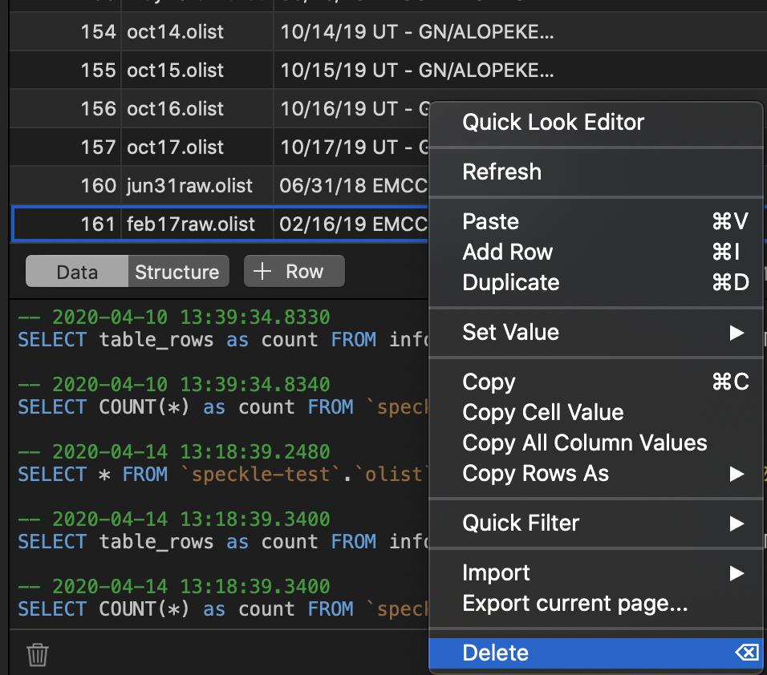

# Scripts for Speckle Imaging Project

### olist-to-csv.py
- Used to convert an .olist file into its corresponding .csv file.
- Olist files contain 10 columns, with multiple rows, and comments. The goal is to extract all 10 columns into entries within a csv row, as well as take the coordinates of a row, and enter in additional information from querying SIMBAD (objects received from a coordinate search and what radius was used)

Example Usage:

**Step 1: Install dependencies if not already install**

```console
foo@bar:speckle-imaging/tools/olist-to-csv$ python3 -m pip install <MODULE_NAME>
```

**Step 2: Run the script**

```console
foo@bar:speckle-imaging/tools/olist-to-csv$ python3 olist-to-csv.v2.py
```

**Step 3a: Choose an olist file from prompt**


**Step 3b: Observe terminal for errors and/or freezes**

```console
DEPRECATION WARNING: The system version of Tk is deprecated and may be removed in a future release. Please don't rely on it. Set TK_SILENCE_DEPRECATION=1 to suppress this warning.
Blob successfully inserted into olist table
Row successfully written to new csv file...
Line of metadata successfully inserted into metadata table
Row successfully written to new csv file...
Line of metadata successfully inserted into metadata table
Row successfully written to new csv file...
Line of metadata successfully inserted into metadata table
...
...
...
Done writing file.
File written as: 2020-04-10-20:39:45.895491.jun31raw.olist.csv

foo@bar:speckle-imaging/tools/olist-to-csv$
```

**Step 4: Determine if run was successful, semi-successful, or ultimately won't work with the current script**

Example successful run:

```console
Blob successfully inserted into olist table
Row successfully written to new csv file...
Line of metadata successfully inserted into metadata table
Row successfully written to new csv file...
Line of metadata successfully inserted into metadata table
Row successfully written to new csv file...
Line of metadata successfully inserted into metadata table
...
...
...
Done writing file.
File written as: 2020-04-10-20:39:45.895491.jun31raw.olist.csv

foo@bar:speckle-imaging/tools/olist-to-csv$
```

Example semi-successful run:

```console
...
Row successfully written to new csv file...
Line of metadata successfully inserted into metadata table
Done writing file.
File written as: 2020-04-10-23:01:58.030060.feb17raw.olist.csv
THERE WAS AN ERROR CHECK LOGS
There were 1 in this batch, check olist.log and manually import the data or fork/edit the script
foo@bar:speckle-imaging/tools/olist-to-csv$
```


In a case like this, the lines of the olist file in which the parsing and insertion failed at will be appended to "olist.log" in the same directory as the script. In our case, here's the error message we got:

```
Value Error: ('Cannot parse first argument data "20.44KOSAKOWSKI/J0822" for attribute ra', ValueError("Invalid character at col 5 in angle '20.44KOSAKOWSKI/J0822'")) - File: feb17raw.olist - Line: H119000 10:30 08:22:39.5 +30:48:57 2000.00 20.44 KOSAKOWSKI/J0822+3048 - Time: 2020-04-10 16:01:57.083251
```

We can create and run a SQL statement on the database to manually insert the invalid data or fill it in with a MySQL client of your choice.

Failed Runs:

In failed runs (runs with more errors than can be manually entered), use your best judgement as to whether or not a re-run is needed or a fork of the script is needed.

*Note: Before re-running, please drop the olist row that you plan on rerunning.*




### ~~fits-header-to-csv.py~~
**Development on this script/CLI halted. Somewhat functional at this point.**

Description: Outputs a .csv file based on a .fits file's header
- Developed on Python 3.7
- Running the script will open up a file dialogue prompt for the user to choose which fits file they want to convert into a .csv file
- Currently, it is undecided whether we want the data to be manually imported after the script runs or for it to be inserted/imported at runtime
- This script assumes the following file input naming convention:
    - Example file name: **N20190610A0415b.fits**
	- **N**20190610A0415b.fits
		 - N = North, S = South
	- N**20190610**A0415b.fits
		 - UTC time
	- N20190610**A**0415b.fits
		 - A = Alopeke, Z = Zorro
	- N20190610A**0415**b.fits
		 - 0 - 9999, repesenting the fits file taken during an observing run (resetted each run)
	- N20190610A0415**b**.fits
		 - Which channel the fits file is from (red or blue)
